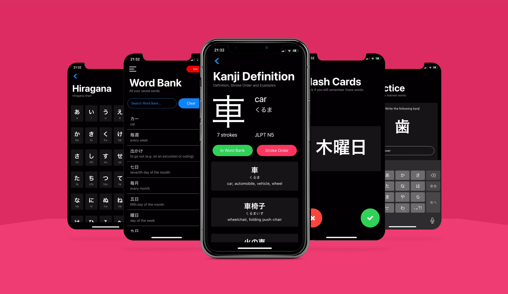
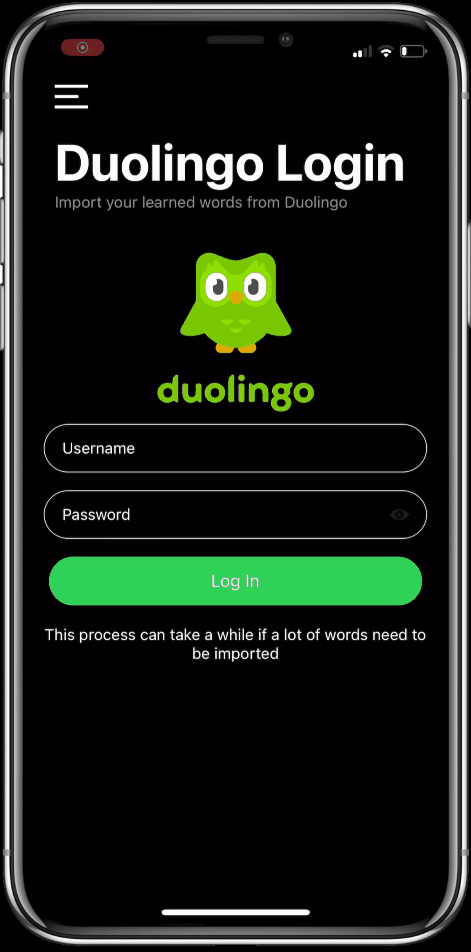

<h1> Japanese Dictionary IOS</h1>

An IOS app based on my previous windows app, available in [this repo](https://github.com/galmeida9/japanese_dictionary). This app was developed using React Native and Expo.

## Index

* [Requirements](#requirements)
* [Installation](#installation)
* [Features](#features)
    * [Dictionary](#dictionary)
    * [Word Bank](#word-bank)
    * [Flash Cards](#flash-cards)
    * [Practice](#practice)
    * [Study Material](#study-material)
    * [Duolingo Login](#duolingo-login)
    * [Dark Mode](#dark-mode)

## Requirements

* [npm](https://www.npmjs.com/)
* [expo](https://expo.io/)
* If you are using an emulator, check [this link](https://developer.apple.com/documentation/xcode/running_your_app_in_the_simulator_or_on_a_device), or if you have an iOS device you can try it there with the [expo go app](https://apps.apple.com/pt/app/expo-go/id982107779)

## Installation

1. Clone the Repository
2. Run ``npm install`` in the root directory
3. Run ``expo start -c`` in the root directory to start the local server for the app
    1. If using an emulator click on the respective button in your browser, if you are using a real device scan the QR Code in the iOS camera app to open the project in the ``expo go`` app.

## Features

### Dictionary

Searches in english, hiragana, katakana, kanji and romanji in the Jisho.org dictionary. In each word it is possible to view some examples, stroke order for kanjis, and the option to add it to your word bank.

### Word Bank

Stores all your added words, giving you the ability to search them, consult them, check their definition and delete them.

### Flash Cards

Shows random words from the word bank to practice reading and memorization, if you tap on the word it flips the card to show you the reading and meaning. With a 30% probability, the words that you have failed will show up again to help you remember them.

### Practice

Select number of words to practice, if the word is in kanji it is asked to write it, otherwise it asks for their meaning in english. in the end a score is given from 0 to 100%.

### Study Material

Compilation of materials to help you study, from hiragana and katakana charts to Youtube video lessons.

### Duolingo Login

Login into your duolingo account to import all the words you have learned so far into your word bank.

### Dark Mode

Dark mode is binded to your system settings and it updates automatically if you change it.

